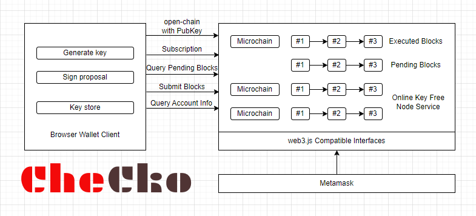

### CheCko: Another browser wallet for Linera blockchain by ResPeer

#### CheCko Wallet

In Linera design, the whole microchain will be run in the browser extension. That's a pretty cool idea that users do not need to depend on operators who run blockchain nodes to provide blockchain API service. But user won't run their brower extension forever. When they leave their computer, they will shut down their browser. After they come back, they have to synchronize microchain data from validators again. With time flying, there will be more applications run on Linera, and the microchain data may grow day by day. The microchain data will be huge someday. As we know, large storage in the browser may cause it to crash and lose data. So, ResPeer has an idea to separate the wallet client and Linera Node Service.

#### Linera Node Service

Linera Node Service is actually the wallet system of Linera. It will hold the keys of accounts, run microchains of the wallet, and will be run in browser extensions in the future. Microchain owner extends their microchain blocks by call operation to Node Service, then Node Service will pack operations into new blocks with incoming messages.

#### How it Works

We probably need to let Node Service not generate new blocks automatically, and let the wallet client be able to get data to be signed to sign and then submit to Node Service for execution. The workflow is mainly as follows:

As the figure described, Linera Node Service won't store acount keys and sign blocks anymore. Instead of that, it maintains a pending blocks list in which all of the blocks are constructed but not signed. When the browser wallet client is launched, it'll subscribe to Node Service for new block notifications. Of course, if the Node Service do not have a microchain for the local account, it could create one with its public key, and keep the private key in wallet client keystore locally.

#### About CheCko

Basically, CheCko is the wallet login system of ResPeer. But for a stable web3 application service, we think it deserves to have a microchain cluster to provide stable service for ResPeer users. So we create CheCko with such a `Microchain as a Service` architecture. And for the Linera ecosystem, we think of that other applications can also use this architecture to simplify their application development.

#### Call CheCko from Web Application

#### Todo

- [X] Construct block with rust
- [X] Move block signer to background
- [X] Implement web3.js apis
