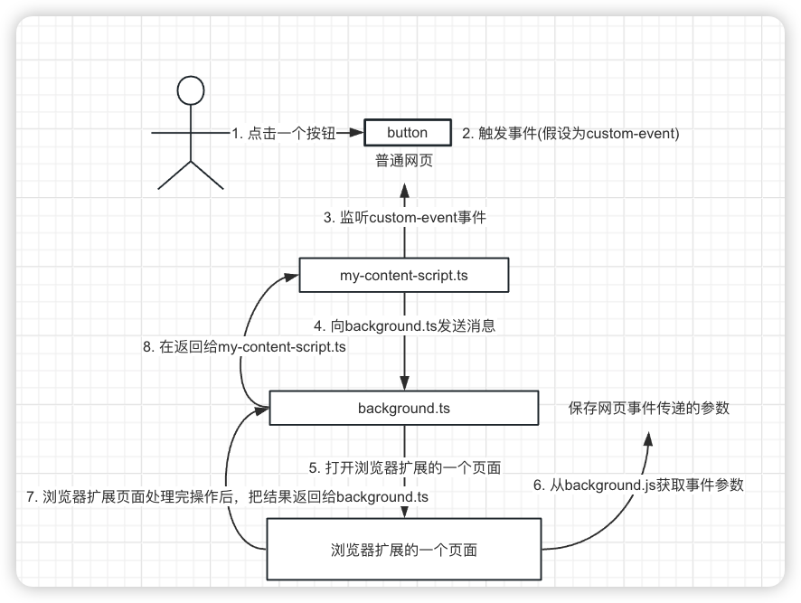

### 普通网页调用插件的流程

#### 浏览器扩展目录结构介绍

```shell
src-bex
├── assets
│   └── content.css
├── background.ts
├── bex-flag.d.ts
├── dom.ts
├── icons
│   ├── favicon.png
├── manifest.json
└── my-content-script.ts
```

- my-content-script.ts会注入到网页中，与网页原有的JavaScript共享DOM，但会与网页原有的JavaScript隔离
- background.ts是后台脚本，在浏览器扩展本身的上下文中运行，并且可以侦听所有可用的浏览器扩展事件。


普通网页与浏览器扩展的通信思路如下：

	

普通网页示例代码：

```vue

<template>
  <div>
    <q-input type='text' v-model:model-value="transfer.Address" label="Address" />
    <q-input type='text' v-model:model-value="transfer.Amount" label="Amount" />
    <div style="margin-top: 20px;" />
    <q-btn id="myButton" @click="onClick"> 从网页发送消息给浏览器扩展</q-btn>
    <div>从浏览器扩展传回的消息: </div>
    <div id="extension"></div>
  </div>
</template>

<script setup lang="ts">
import { ref } from 'vue';

interface TransferEvent {
  Amount: string
  Address: string
}

const transfer = ref({ Address: '653ca9bb-b7e6-4c41-8138-4f66ba7de685', Amount: '10' } as TransferEvent)
const onClick = () => {
  const myEvent = new CustomEvent('message.to.quasar', {
    detail: { ...transfer.value }
  })
  window.dispatchEvent(myEvent)
}

</script>
```

